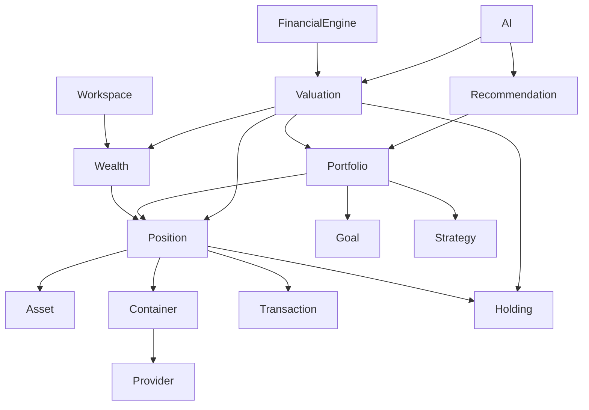

# WEALTH_MODEL

Document ID: DOM-WEALTH-001  
Version: 0.1  
Status: Accepted  
Owner: Product & Architecture

## Depends On

- PROJECT_CONSTITUTION.md
- PROJECT_PHILOSOPHY.md
- PRODUCT_PRINCIPLES.md
- PRODUCT_VISION.md
- UBIQUITOUS_LANGUAGE.md
- BUSINESS_CAPABILITIES.md

## Required By

- DOMAIN_MODEL.md
- DATA_MODEL.md
- FINANCIAL_ENGINE.md
- PORTFOLIO_MANAGEMENT.md
- ASSET_MANAGEMENT.md
- TRANSACTION_MANAGEMENT.md
- DASHBOARD_SYSTEM.md
- AI_ARCHITECTURE.md

---

# 1. Purpose

This document defines how wealth is conceptually represented inside the Wealth Platform.

It is one of the foundational domain documents of the project.

Its purpose is to answer the question:

> What is wealth in the context of the Wealth Platform?

This document does not define database tables, APIs or UI screens.

It defines the business model that all future technical designs must respect.

---

# 2. Core Definition

In the Wealth Platform, **Wealth** is the complete digital representation of everything of measurable economic value that belongs to a Workspace at a specific point in time.

Wealth is not a single number.

Wealth is a structured model composed of:

- assets;
- positions;
- holdings;
- containers;
- portfolios;
- goals;
- strategies;
- transactions;
- historical valuations;
- recommendations;
- knowledge.

---

# 3. Wealth Is Not the Same as Cash

The platform must not reduce wealth to liquid money.

Wealth may include:

- bank balances;
- cash;
- stocks;
- ETFs;
- bonds;
- cryptoassets;
- stablecoins;
- commodities;
- precious metals;
- real estate;
- private company shares;
- startup equity;
- crowdlending;
- vehicles;
- art;
- collectibles;
- other tangible or intangible assets.

The model must support both financial and non-financial assets.

---

# 4. Wealth Is a Structure, Not a Number

A user's wealth is not simply:

```text
Total Wealth = Sum of Asset Values
```

This is only one derived view.

The real model is:

```text
Workspace
└── Wealth
    ├── Positions
    ├── Holdings
    ├── Assets
    ├── Containers
    ├── Portfolios
    ├── Goals
    ├── Strategies
    ├── Transactions
    └── Historical Evolution
```

The total wealth value is calculated by the Financial Engine.

---

# 5. Asset

An **Asset** is a universal item with measurable economic value.

Examples:

- BTC
- EUR
- Apple Share
- Gold
- Real Estate Property
- Private Company Stake
- Crowdlending Loan

An Asset may exist even if no user owns it.

Assets are not user-specific by default.

---

# 6. Position

A **Position** is the atomic representation of owned wealth.

A Position represents:

> A quantity of one Asset, located in one Container, belonging to one Workspace, at a specific point in time.

A Position answers:

- What asset is owned?
- How much is owned?
- Where is it located?
- Which workspace owns it?
- What is its current valuation?
- What is its historical cost basis?
- Which transactions created or modified it?

Example:

```text
Position
Asset: BTC
Quantity: 3.25
Container: Kraken Account
Workspace: Esteve Personal Workspace
Currency: EUR
Acquisition Cost: 74,200 EUR
Current Value: 82,100 EUR
```

---

# 7. Holding

A **Holding** is an aggregation of Positions for the same Asset.

Example:

```text
Holding: BTC

Positions:
- 1.2 BTC in Binance
- 0.8 BTC in Kraken
- 1.25 BTC in Ledger

Total Holding:
- 3.25 BTC
```

A Holding is not the atomic ownership unit.

The Position is the atomic ownership unit.

The Holding is a calculated business view.

---

# 8. Container

A **Container** is the place where Positions exist.

Examples:

- bank account;
- brokerage account;
- exchange account;
- crypto wallet;
- safe deposit box;
- real estate property;
- vault;
- crowdlending platform account;
- private company cap table.

A Container may be connected to a Provider, but not always.

For example:

- Kraken Account → Provider: Kraken
- Ledger Wallet → Provider: none or blockchain network
- Physical Gold Vault → Provider: vault company
- Real Estate Property → Provider: none

---

# 9. Provider

A **Provider** is an external entity that provides access to financial or asset data.

Examples:

- ING
- Revolut
- Binance
- Kraken
- Trade Republic
- Civislend

The Provider is never the owner of the wealth.

The Provider only stores, manages, reports or gives access to information about Positions or Transactions.

---

# 10. Portfolio

A **Portfolio** is a business grouping of Positions created to pursue one financial objective.

A Portfolio is not a bank account, broker account or exchange account.

A Portfolio is independent from Providers and Containers.

Example:

```text
Portfolio: Retirement Portfolio

Includes:
- BTC Positions across multiple exchanges and wallets
- ETF Positions in a broker
- Gold Position in a vault

Goal:
- Reach 600,000 EUR by 2045

Strategy:
- Long-term growth with controlled risk
```

A Position may be assigned fully or partially to one or more Portfolios if allocation logic is required in the future.

For the initial model, the platform should support at least assigning Positions to Portfolios.

---

# 11. Goal

A **Goal** is a measurable financial objective associated with one Portfolio.

Examples:

- reach 600,000 EUR by 2045;
- obtain 5% annual return for 5 years;
- preserve capital over 3 years;
- build an emergency fund;
- prepare for retirement.

A Goal gives meaning to a Portfolio.

Without a Goal, a Portfolio is only a grouping mechanism.

---

# 12. Strategy

A **Strategy** defines how a Portfolio intends to achieve its Goal.

A Strategy may include:

- target return;
- risk tolerance;
- asset allocation limits;
- liquidity requirements;
- time horizon;
- contribution plan;
- maximum concentration;
- geographic exposure;
- currency exposure.

A Strategy must be time-aware.

Example:

```text
Strategy:
Target return: 5% annually
Time horizon: 5 years
Maximum crypto exposure: 20%
Minimum liquidity: 10%
```

---

# 13. Transaction

A **Transaction** is an immutable financial event that changes one or more Positions.

Examples:

- buy;
- sell;
- deposit;
- withdrawal;
- transfer;
- dividend;
- interest;
- salary;
- fee;
- staking reward;
- crypto airdrop;
- tax payment.

Transactions do not directly modify Portfolios.

Transactions modify Positions.

Portfolios reflect the effects of Transactions through the Positions assigned to them.

---

# 14. Valuation

A **Valuation** is the calculated value of a Position, Holding, Portfolio or total Wealth at a specific point in time.

Valuations are produced by the Financial Engine.

AI must never generate valuations independently.

Valuation requires:

- asset quantity;
- asset price;
- currency conversion;
- valuation date;
- source data;
- calculation rules.

---

# 15. Domain Invariants

The following rules must always be true.

## INV-001 — Wealth belongs to a Workspace

Every representation of Wealth belongs to exactly one Workspace.

## INV-002 — Asset is universal

An Asset can exist independently from a Workspace.

## INV-003 — Position is the atomic ownership unit

The smallest unit of owned wealth is a Position.

## INV-004 — Position references one Asset

A Position always refers to exactly one Asset.

## INV-005 — Position exists in one Container

A Position is located in exactly one Container.

## INV-006 — Holding aggregates Positions

A Holding is derived from one or more Positions of the same Asset.

## INV-007 — Transactions modify Positions

Transactions modify Positions, not Portfolios directly.

## INV-008 — Portfolio groups Positions

A Portfolio groups Positions to pursue a Goal.

## INV-009 — Portfolio has one primary Goal

A Portfolio is associated with one primary Goal.

## INV-010 — Strategy belongs to Portfolio context

A Strategy defines how a Portfolio should pursue its Goal.

## INV-011 — Provider is not owner

A Provider never owns the user's wealth in the platform model.

## INV-012 — Financial Engine calculates

All wealth values are calculated by the Financial Engine.

## INV-013 — AI explains

AI may explain Wealth, Positions, Holdings and Portfolios but must not calculate financial truth.

## INV-014 — History is preserved

Historical financial state must not be destroyed.

## INV-015 — Traceability is mandatory

Every calculated value must be traceable to source data.

---

# 16. Conceptual Diagram



---

# 17. Business Implications

This model implies:

- Positions are the primary unit for calculations.
- Holdings are derived views.
- Portfolios are strategic groupings.
- Providers are external data sources, not domain owners.
- Transactions are immutable events.
- Wealth is calculated, not manually entered.
- AI explains and assists but does not define truth.

---

# 18. MVP Implications

For the initial product, the platform should support:

- Workspaces;
- Assets;
- Containers;
- Positions;
- Holdings;
- Transactions;
- Portfolios;
- Goals;
- Strategies;
- basic valuations;
- portfolio-level dashboards;
- manual and imported transactions.

Advanced features such as automated portfolio execution, complex simulations and multi-step rebalancing workflows may be deferred.

---

# 19. Open Questions

| ID | Question | Status |
|----|----------|--------|
| OQ-001 | Can a Position be partially allocated to multiple Portfolios in MVP? | Open |
| OQ-002 | Should liabilities be included in the first Wealth Model version? | Open |
| OQ-003 | Should manual assets without market prices be valued manually or through periodic appraisal records? | Open |
| OQ-004 | Should a Holding be persisted or always calculated? | Open |

---

# 20. Change Log

| Version | Description |
|---------|-------------|
| 0.1 | Initial Wealth Model definition |
