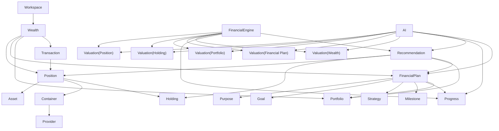

# WEALTH_MODEL

Document ID: DOM-WEALTH-001  
Version: 1.0  
Status: Draft  
Owner: Product & Architecture

## Depends On

- PROJECT_CONSTITUTION.md
- PROJECT_PHILOSOPHY.md
- PRODUCT_PRINCIPLES.md
- PRODUCT_VISION.md
- UBIQUITOUS_LANGUAGE.md
- BUSINESS_CAPABILITIES.md

## Required By

- DOMAIN_MODEL.md
- DATA_MODEL.md
- FINANCIAL_ENGINE.md
- FINANCIAL_PLANNING.md
- PORTFOLIO_MANAGEMENT.md
- ASSET_MANAGEMENT.md
- TRANSACTION_MANAGEMENT.md
- DASHBOARD_SYSTEM.md
- AI_ARCHITECTURE.md

---

# 1. Purpose and Authority

This document is the **authoritative conceptual model** of the Wealth Platform.

It defines what wealth is, how domain concepts relate to each other and which invariants every capability, calculation and integration must respect.

It answers:

> What is wealth in the context of the Wealth Platform?

**Relationship to other documents:**

| Document | Role |
|----------|------|
| UBIQUITOUS_LANGUAGE.md | Authoritative business vocabulary |
| WEALTH_MODEL.md | Authoritative conceptual structure and relationships |
| Capability specifications | Authoritative behaviour within each bounded area |
| DATA_MODEL.md (future) | Technical persistence of this model |

This document does not define database tables, APIs or UI screens.

---

# 2. Conceptual Overview

Wealth is not a single number. It is a structured representation of everything of measurable economic value that belongs to a **Workspace** at a specific point in time.

The model is organized into six conceptual layers:

```text
Workspace
└── Wealth
    ├── Tenancy Layer          → Workspace
    ├── Ownership Layer        → Position, Holding
    ├── Reference Layer        → Asset, Asset Class
    ├── Location Layer         → Container, Provider
    ├── Execution Layer        → Portfolio
    ├── Planning Layer         → Financial Plan, Purpose, Goal, Strategy, Milestone, Progress
    ├── Event Layer            → Transaction
    └── Calculation Layer      → Valuation, Financial Engine, Recommendation, AI Assistant
```

Each layer has a distinct responsibility. Concepts must not be mixed across layers.

---

# 3. Tenancy Layer

## Workspace

The **Workspace** is the top-level business boundary.

Everything that represents a user's wealth, planning context, Portfolios, Providers and settings belongs to exactly one Workspace.

A Workspace belongs to an individual or an Organization.

**Invariant:** Every owned concept — Positions, Financial Plans, Portfolios, Transactions — belongs to exactly one Workspace.

---

# 4. Ownership Layer

Ownership answers: *What does the user own, how much and where?*

## Position

The **Position** is the atomic unit of owned wealth.

A Position represents:

> A quantity of one Asset, located in one Container, belonging to one Workspace.

A Position is the only concept that represents direct ownership. Users do not own Assets, Holdings, Portfolios or Providers directly.

A Position answers:

- What Asset is owned?
- How much is owned?
- Where is it located?
- Which Workspace owns it?
- Which Transactions created or modified it?

Example:

```text
Position
Asset: BTC
Quantity: 3.25
Container: Kraken Account
Workspace: Esteve Personal Workspace
```

Valuations and cost basis for a Position are calculated by the Financial Engine.

## Holding

The **Holding** is an aggregation of Positions for the same Asset within a Workspace.

Example:

```text
Holding: BTC

Positions:
- 1.2 BTC in Binance
- 0.8 BTC in Kraken
- 1.25 BTC in Ledger

Total: 3.25 BTC
```

A Holding is a derived business view. It is not the atomic ownership unit.

**Invariant:** The smallest unit of owned wealth is always a Position.

---

# 5. Reference Layer

References answer: *What economic entities exist, independent of who owns them?*

## Asset

An **Asset** is a universal item with measurable economic value.

Examples:

- BTC
- EUR
- Apple Share
- Gold
- Real Estate Property
- Private Company Stake
- Crowdlending Loan

Assets are **canonical master data**. They exist independently of any Workspace. Users own Positions that **reference** Assets; they do not own Assets directly.

An Asset may exist even if no user currently holds a Position in it.

Asset definitions are governed by Asset Management.

## Asset Class

An **Asset Class** categorizes similar Assets (Equity, Crypto, Real Estate, Precious Metals, Cash, Private Equity, etc.).

Every Asset belongs to one primary Asset Class.

---

# 6. Location Layer

Location answers: *Where does owned wealth physically or logically reside?*

## Container

A **Container** is the place where Positions exist.

Examples:

- bank account
- brokerage account
- exchange account
- crypto wallet
- safe deposit box
- real estate property
- vault
- crowdlending platform account
- private company cap table

A Position exists in exactly one Container.

## Provider

A **Provider** is an external entity that stores, manages, reports or gives access to financial or asset data.

Examples:

- ING
- Revolut
- Binance
- Kraken
- Trade Republic
- Civislend

A Container may be connected to a Provider, but not always:

- Kraken Account → Provider: Kraken
- Ledger Wallet → Provider: none or blockchain network
- Real Estate Property → Provider: none

**Invariant:** A Provider is never the owner of user wealth. Provider data is external evidence, not domain truth.

---

# 7. Execution Layer

Execution answers: *How is owned wealth organized for investment analysis?*

## Portfolio

A **Portfolio** is a logical investment grouping of Positions.

A Portfolio:

- groups Positions across Containers and Providers;
- supports one or more Financial Plans as an investment instrument;
- is **not** a bank account, broker account, exchange account or Provider account;
- does not own Assets directly;
- does not define Purpose, Goals, Strategies or Milestones.

Example:

```text
Portfolio: Retirement Execution Portfolio

Includes:
- BTC Positions across multiple exchanges and wallets
- ETF Positions in a broker
- Gold Position in a vault

Linked to:
- Financial Plan: Retirement Plan
```

A Position may be assigned fully or partially to one or more Portfolios. Partial allocation remains an open design question.

Portfolio composition and lifecycle are governed by Portfolio Management. Planning context belongs to Financial Planning.

---

# 8. Planning Layer

Planning answers: *Why is wealth being managed and how is success measured?*

## Financial Plan

The **Financial Plan** is the primary business planning entity of the Wealth Platform.

A Financial Plan belongs to exactly one Workspace and provides the planning context above Providers, Containers and individual Portfolios.

A Financial Plan contains:

- **Purpose** — why the plan exists
- **Goals** — measurable objectives
- **Strategies** — rules for achieving Goals
- **Milestones** — expected checkpoints toward Goals
- **Progress** — deterministic advancement toward Goals
- **Linked Portfolios** — investment instruments that execute the plan

Example:

```text
Financial Plan: Retirement Plan
Purpose: Fund retirement from age 60
Goal: Reach 600,000 EUR by 2045
Strategy: Long-term growth with controlled risk
Milestone: Reach 300,000 EUR by 2035
Progress: 42% (calculated by Financial Engine)
Linked Portfolios:
- Retirement Execution Portfolio
- Conservative Income Portfolio
```

## Purpose

**Purpose** is the declared intent of a Financial Plan.

Examples: retirement, education funding, wealth preservation, property purchase, income generation.

An active Financial Plan must declare exactly one Purpose.

## Goal

A **Goal** is a measurable financial objective within a Financial Plan.

Examples:

- reach 600,000 EUR by 2045
- obtain 5% annual return for 5 years
- build an emergency fund of 30,000 EUR
- preserve capital over 3 years

Goals belong to Financial Plans, not to Portfolios.

## Strategy

A **Strategy** defines how a Financial Plan intends to achieve its Goals.

A Strategy may include:

- target return
- risk tolerance
- asset allocation limits
- liquidity requirements
- time horizon
- contribution plan
- maximum concentration
- geographic exposure
- currency exposure

Strategies are time-aware and belong to Financial Plans, not to Portfolios.

## Milestone

A **Milestone** is a checkpoint within a Financial Plan that marks expected progress toward one or more Goals at a specific point in time.

Examples:

- reach 100,000 EUR by 2030
- achieve 50% of retirement Goal by age 50

## Progress

**Progress** is the measured advancement of a Financial Plan toward its Goals.

Progress is:

- calculated exclusively by the Financial Engine
- derived from Positions, Transactions, linked Portfolios and planning rules
- traceable to source financial data
- never manually entered as financial truth

Financial Planning requests and displays Progress. It does not compute it.

## Linked Portfolios

**Linked Portfolios** associate Portfolios with a Financial Plan as investment instruments.

Rules:

- a Financial Plan may link one or more Portfolios
- a Portfolio may support one or more Financial Plans
- linking does not modify Positions or Portfolio composition

---

# 9. Event Layer

Events answer: *What changed ownership and when?*

## Transaction

A **Transaction** is an immutable financial event that modifies one or more Positions.

Examples:

- buy
- sell
- deposit
- withdrawal
- transfer
- dividend
- interest
- salary
- fee
- staking reward
- crypto airdrop
- tax payment

Transactions:

- modify Positions directly
- do not modify Portfolios directly
- do not modify Financial Plans directly
- are never edited or deleted after posting

Corrections are represented through additional correcting Transactions.

Portfolios and Financial Plans reflect the effects of Transactions through the Positions assigned or linked to them.

---

# 10. Calculation and Intelligence Layer

## Valuation

A **Valuation** is a deterministic calculated view produced by the Financial Engine.

A Valuation does not own domain data and does not modify domain state.

Valuations may exist for:

- Position
- Holding
- Portfolio
- Financial Plan
- Total Wealth

A Valuation always represents the calculated economic value of a target concept at a specific point in time and must be traceable to source data and calculation rules.

## Financial Engine

The **Financial Engine** is the deterministic source of financial truth.

It calculates:

- valuations
- cost basis
- performance
- allocation
- Progress toward Goals
- inputs for Recommendations

No other component may produce financial truth.

## Recommendation

A **Recommendation** is an explainable suggestion generated from deterministic financial analysis.

A Recommendation may reference any relevant business concept, including:

- Position
- Holding
- Portfolio
- Financial Plan

Recommendations must expose the evidence, calculations and rules that produced them.

Recommendations may support user decision-making, but they must not execute operations or modify domain state.

## AI Assistant

The **AI Assistant** is an explanatory layer.

AI may:

- explain Wealth, Positions, Holdings, Portfolios and Financial Plans
- explain Valuations, Progress and Recommendations
- compare plans and suggest drafts for user review

AI must not:

- calculate financial truth
- modify Transactions, Positions or calculated Progress
- override the Financial Engine

---

# 11. Ownership vs References

A core architectural decision of this model is the separation between **ownership** and **references**.

| Concept | Type | Meaning |
|---------|------|---------|
| Position | Ownership | What the user owns |
| Holding | Derived ownership view | Aggregated exposure to one Asset |
| Asset | Reference | Universal economic entity |
| Container | Location | Where a Position exists |
| Provider | External reference | Source of external evidence |
| Portfolio | Execution grouping | Investment organization of Positions |
| Financial Plan | Planning context | Why and how wealth is managed |
| Transaction | Ownership event | Immutable change to Positions |
| Valuation | Calculated view | Financial Engine output |
| Progress | Calculated view | Financial Engine output |

**Rules:**

1. Only Positions represent owned wealth.
2. Assets are referenced by Positions but never owned directly.
3. Providers supply evidence about Positions and Transactions but never own wealth.
4. Portfolios group Positions but do not own them.
5. Financial Plans provide planning context but do not own Positions.
6. All calculated financial values come from the Financial Engine.

---

# 12. Wealth Composition

Wealth is not limited to cash or liquid instruments.

Wealth may include:

- bank balances and cash
- stocks, ETFs and bonds
- cryptoassets and stablecoins
- commodities and precious metals
- real estate
- private company shares and startup equity
- crowdlending
- vehicles, art and collectibles
- other tangible or intangible assets

The model supports both financial and non-financial assets.

Total wealth value is a derived view:

```text
Total Wealth = calculated by the Financial Engine from Positions
```

It is not the structural model itself.

---

# 13. Conceptual Diagram

## Layer model



## Complete structure

```text
Workspace
└── Wealth
    ├── Positions              (atomic ownership)
    ├── Holdings               (derived aggregation)
    ├── Financial Plans
    │   ├── Purpose
    │   ├── Goals
    │   ├── Strategies
    │   ├── Milestones
    │   ├── Progress
    │   └── Linked Portfolios
    ├── Portfolios             (investment grouping)
    ├── Transactions           (immutable history)
    └── Historical Evolution   (valuations, performance)
```

---

# 14. Domain Invariants

The following rules must always be true.

## Tenancy

**INV-001 — Wealth belongs to a Workspace**

Every representation of Wealth belongs to exactly one Workspace.

## Ownership

**INV-002 — Position is the atomic ownership unit**

The smallest unit of owned wealth is a Position.

**INV-003 — Position references one Asset**

A Position always refers to exactly one Asset.

**INV-004 — Position exists in one Container**

A Position is located in exactly one Container.

**INV-005 — Holding aggregates Positions**

A Holding is derived from one or more Positions of the same Asset within a Workspace.

## References

**INV-006 — Asset is universal**

An Asset can exist independently from a Workspace. Assets are canonical master data.

**INV-007 — Users own Positions, not Assets**

Ownership is always expressed through Positions.

**INV-008 — Provider is not owner**

A Provider never owns the user's wealth in the platform model.

## Events

**INV-009 — Transactions modify Positions**

Transactions modify Positions. They do not modify Portfolios or Financial Plans directly.

**INV-010 — Transactions are immutable**

Posted Transactions are never edited or deleted. Corrections require new Transactions.

## Execution

**INV-011 — Portfolio groups Positions**

A Portfolio groups Positions for investment analysis and execution. It is not a Provider account.

**INV-012 — Portfolio does not own planning context**

Purpose, Goals, Strategies and Milestones do not belong to Portfolios.

## Planning

**INV-013 — Financial Plan is the primary planning entity**

All planning context belongs to a Financial Plan.

**INV-014 — Goals belong to Financial Plans**

A Goal is always scoped to a Financial Plan.

**INV-015 — Strategies belong to Financial Plans**

A Strategy is always scoped to a Financial Plan.

**INV-016 — Progress is calculated**

Progress is calculated by the Financial Engine and is never manually entered as financial truth.

**INV-017 — Portfolios support Financial Plans**

Portfolios are investment instruments linked to Financial Plans. They execute planning intent through Position groupings.

## Calculation and intelligence

**INV-018 — Financial Engine calculates**

All wealth values, valuations, performance metrics and Progress are calculated by the Financial Engine.

**INV-019 — AI explains**

AI may explain domain concepts and calculated outputs but must not create financial truth.

**INV-020 — History is preserved**

Historical financial and planning state must not be destroyed.

**INV-021 — Traceability is mandatory**

Every calculated value must be traceable to source data and calculation rules.

---

# 15. Capability Mapping

This table maps domain concepts to their owning capabilities.

| Concept | Owning Capability |
|---------|-------------------|
| Workspace | Workspace Management |
| Asset, Asset Class | Asset Management |
| Position, Holding | Asset Management (views), Transaction Management (creation via events) |
| Container | Workspace / Provider Integration |
| Provider, Connector, Synchronization | Provider Integration |
| Transaction | Transaction Management |
| Portfolio | Portfolio Management |
| Financial Plan, Purpose, Goal, Strategy, Milestone | Financial Planning |
| Progress | Financial Engine (calculated), Financial Planning (displayed) |
| Valuation, performance, allocation | Financial Engine / Financial Intelligence |
| Recommendation | Financial Intelligence |
| AI explanations | Artificial Intelligence |

Capabilities must respect the invariants defined in this document.

---

# 16. Business Implications

This model implies:

- **Positions** are the primary unit for ownership and calculations.
- **Holdings** are derived views, not ownership units.
- **Assets** are shared reference data, not user property.
- **Providers** are external evidence sources, not domain owners.
- **Portfolios** organize Positions for investment execution and analysis.
- **Financial Plans** provide the planning context above Portfolios.
- **Transactions** are immutable ownership events.
- **Wealth values** are calculated, not manually entered.
- **AI** explains and assists but does not define truth.

Investment recommendations remain portfolio-aware (portfolio-centric analysis) while long-term planning context lives in Financial Plans.

---

# 17. MVP Implications

For the initial product, the platform should support:

- Workspaces
- Assets and Asset Classes
- Containers
- Positions
- Holdings (derived)
- Transactions (manual and imported)
- Portfolios with Position assignment
- Financial Plans with Purpose, Goals and Strategies
- basic Milestones
- basic Progress calculation via the Financial Engine
- basic valuations
- portfolio-level dashboards
- linking Portfolios to Financial Plans

Advanced features such as automated rebalancing, complex simulations, multi-step planning workflows and partial Position allocation may be deferred.

---

# 18. Open Questions

| ID | Question | Status |
|----|----------|--------|
| OQ-001 | Can a Position be partially allocated to multiple Portfolios in MVP? | Open |
| OQ-002 | Should liabilities be included in the first Wealth Model version? | Open |
| OQ-003 | Should manual assets without market prices be valued through periodic appraisal records? | Open |
| OQ-004 | Should a Holding be persisted or always calculated? | Open |
| OQ-005 | How should Progress be aggregated when one Portfolio supports multiple Financial Plans? | Open |
| OQ-006 | Should Milestones be manually defined or auto-generated from Goals in MVP? | Open |

---

# 19. Change Log

| Version | Description |
|---------|-------------|
| 0.1 | Initial Wealth Model definition |
| 1.0 | Refactored as authoritative conceptual model; introduced layered architecture; made Financial Plan the primary planning entity; removed planning concepts from Portfolio; clarified ownership vs references separation; clarified Valuation and Recommendation as calculated/explainable outputs |
