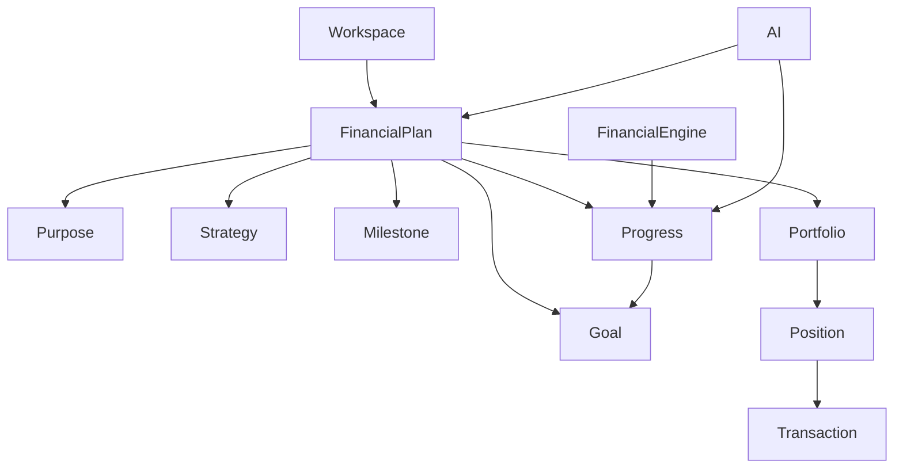

# FINANCIAL_PLANNING

**Document ID:** CAP-FPLAN-001  
**Version:** 0.2  
**Status:** Accepted  
**Owner:** Product & Architecture

---

# Depends On

- PROJECT_CONSTITUTION.md
- PROJECT_PHILOSOPHY.md
- PRODUCT_PRINCIPLES.md
- PRODUCT_VISION.md
- UBIQUITOUS_LANGUAGE.md
- BUSINESS_CAPABILITIES.md
- WEALTH_MODEL.md
- PORTFOLIO_MANAGEMENT.md
- ASSET_MANAGEMENT.md
- TRANSACTION_MANAGEMENT.md

# Required By

- DOMAIN_MODEL.md
- DATA_MODEL.md
- FINANCIAL_ENGINE.md
- DASHBOARD_SYSTEM.md
- AI_ARCHITECTURE.md

---

# Impact Analysis

## New Domain Concepts

- Financial Plan (primary business planning entity owned by this capability)
- Purpose (declared intent within a Financial Plan)
- Milestone (checkpoint within a Financial Plan)
- Progress (deterministic measure calculated by the Financial Engine)
- Linked Portfolio (execution relationship between a Financial Plan and a Portfolio)

## Relocated Domain Concepts

- Goals and Strategies are redefined as concepts owned by Financial Planning.
- Portfolio Management no longer owns planning concepts.

## Affected Documents

- WEALTH_MODEL.md
- BUSINESS_CAPABILITIES.md
- PORTFOLIO_MANAGEMENT.md
- DOMAIN_CONTEXT.md
- FINANCIAL_ENGINE.md (future)

## Breaking Changes

Conceptual only.

No implementation exists yet.

This specification changes the ownership of planning concepts within the domain model.

Accepted documentation must be updated before implementation begins.

---

# 1. Purpose

Financial Planning is the business capability responsible for defining, managing and monitoring **Financial Plans** within a Workspace.

The **Financial Plan** is the primary business planning entity of the Wealth Platform. It defines why wealth is being managed, what success looks like, how progress is measured and which Portfolios execute the plan.

Financial Planning orchestrates planning context. It does not own Positions, calculate valuations or modify wealth directly.

---

# 2. Business Problem

Users manage wealth for specific life purposes: retirement, education, property purchase, capital preservation or income generation.

Traditional tools attach objectives to individual accounts or Portfolios at the provider level. This creates fragmentation:

- the same life goal spans multiple providers and Portfolios;
- progress is measured inconsistently;
- strategies are duplicated or disconnected from actual wealth;
- recommendations lack a unified planning context.

Without a dedicated planning capability, the platform cannot answer questions such as:

- Am I on track for retirement?
- Which Portfolios support my primary Financial Plan?
- What Milestones should I have reached by now?
- How does my current wealth compare to my stated Strategy?

---

# 3. Business Value

Financial Planning provides:

- a single planning context above provider and account boundaries;
- clear articulation of Purpose and measurable Goals;
- time-aware Strategies that guide investment decisions;
- Milestones that make long-term plans actionable;
- deterministic Progress tracking based on verified financial data;
- linkage between planning intent and Portfolio execution;
- explainable planning insights for users and advisors.

---

# 4. Scope

## Included

- Financial Plan lifecycle.
- Purpose definition.
- Goal definition and management.
- Strategy definition and management.
- Milestone definition and management.
- Progress measurement requests to the Financial Engine.
- Linking and unlinking Portfolios to Financial Plans.
- Planning history and archival.
- Planning monitoring triggers (business rules only).

## Excluded

- Portfolio creation and Position assignment (Portfolio Management).
- Transaction recording (Transaction Management).
- Asset catalogue management (Asset Management).
- Valuation, performance or Progress calculation (Financial Engine).
- Automated trade execution.
- Tax filing.
- Robo-advisory or autonomous investment decisions.
- Database schema or API design.

---

# 5. Responsibilities

Financial Planning is responsible for:

- Creating, updating and archiving Financial Plans.
- Defining and maintaining Purpose for each Financial Plan.
- Defining and maintaining Goals within a Financial Plan.
- Defining and maintaining Strategies within a Financial Plan.
- Defining and maintaining Milestones within a Financial Plan.
- Requesting Progress calculations from the Financial Engine.
- Linking Portfolios as investment instruments to Financial Plans.
- Exposing planning context to Dashboards and the AI Assistant.
- Preserving historical planning records.

Financial Planning is **not** responsible for:

- Calculating Progress, valuations, performance or any financial metrics.
- Modifying Positions or Transactions.
- Creating or managing canonical Assets.
- Executing provider synchronizations.
- Generating unexplained recommendations.

---

# 6. Core Concepts

This section defines the business concepts owned or orchestrated by Financial Planning.

## Financial Plan

The **Financial Plan** is the primary business planning entity of the Wealth Platform.

A Financial Plan belongs to exactly one Workspace and provides the planning context for a user's wealth. It aggregates Purpose, Goals, Strategies, Milestones, Progress and Linked Portfolios into a coherent structure.

A Financial Plan answers:

- Why is wealth being managed?
- What does success look like?
- How should wealth evolve over time?
- Which checkpoints mark expected progress?
- How far has the plan advanced?
- Which Portfolios execute the plan?

## Purpose

**Purpose** is the declared intent of a Financial Plan.

Purpose explains why the plan exists. Examples include retirement, education funding, wealth preservation, property purchase or income generation.

An active Financial Plan must declare exactly one Purpose.

## Goals

**Goals** are measurable financial objectives within a Financial Plan.

Examples:

- reach 600,000 EUR by 2045;
- obtain 5% annual return for 5 years;
- build an emergency fund of 30,000 EUR;
- preserve capital over 3 years.

Goals must be expressible in terms that the Financial Engine can evaluate deterministically (for example, target amount, target date or target return).

A Financial Plan may contain one or more Goals.

## Strategies

**Strategies** define how a Financial Plan intends to achieve its Goals.

A Strategy may include:

- target return;
- risk tolerance;
- asset allocation limits;
- liquidity requirements;
- time horizon;
- contribution plan;
- maximum concentration;
- geographic exposure;
- currency exposure.

Strategies are time-aware. A Financial Plan may contain multiple Strategies over its lifetime, but only one Strategy should be active at a time unless explicit versioning rules apply.

## Milestones

**Milestones** are checkpoints within a Financial Plan that mark expected progress toward one or more Goals at a specific point in time.

Examples:

- reach 100,000 EUR by 2030;
- achieve 50% of retirement Goal by age 50;
- maintain minimum liquidity of 10% through Q4.

Milestones make long-term Goals actionable by defining intermediate expectations.

## Progress

**Progress** is the measured advancement of a Financial Plan toward its Goals.

Progress is:

- calculated exclusively by the Financial Engine;
- derived from Positions, Transactions, linked Portfolios and planning rules;
- traceable to source financial data;
- read-only within Financial Planning.

Users must not override calculated Progress with manual financial values. Financial Planning requests and displays Progress but never computes it.

## Linked Portfolios

**Linked Portfolios** are Portfolios associated with a Financial Plan as investment instruments that execute or support the plan.

Rules:

- Portfolios are managed by Portfolio Management and linked by Financial Planning.
- A Portfolio may support one or more Financial Plans.
- A Financial Plan may link one or more Portfolios.
- Linking a Portfolio does not modify Positions or Portfolio composition.
- Portfolios group Positions; Financial Plans provide planning context above Portfolios.

Portfolios are not bank accounts, broker accounts or provider accounts.

## Conceptual structure

A Financial Plan contains:

- Purpose
- Goals
- Strategies
- Milestones
- Progress
- Linked Portfolios



Referenced concepts:

| Concept | Relationship |
|---------|-------------|
| Workspace | Owns Financial Plans |
| Position | Source of wealth state used to calculate Progress |
| Transaction | Immutable history affecting wealth state |
| Financial Engine | Calculates Progress and all financial valuations |
| Recommendation | May reference a Financial Plan for context |

---

# 7. Domain Principles

## Financial Plan is the primary business planning entity

All planning context — Purpose, Goals, Strategies and Milestones — belongs to a Financial Plan, not to a Provider, Container or Portfolio directly.

## Purpose defines intent

Every active Financial Plan must declare a Purpose that explains why the plan exists.

## Goals are measurable

A Goal must be expressed in terms that can be evaluated deterministically by the Financial Engine.

## Strategies are time-aware

A Strategy may change over time but each version must remain traceable.

## Milestones make plans actionable

Milestones translate long-term Goals into intermediate checkpoints with expected outcomes at specific dates.

## Progress is deterministic

Progress is never manually entered as financial truth. The Financial Engine calculates it from Positions, Transactions, linked Portfolios and planning rules.

## Portfolios are investment instruments

Portfolios group Positions to implement a Financial Plan. Financial Planning links Portfolios; Portfolio Management owns Portfolio structure and composition.

## Financial Planning does not calculate valuations

All valuations, performance metrics and Progress calculations are delegated to the Financial Engine.

## History is preserved

Financial Plans, Goals, Strategies and Milestones are archived rather than deleted whenever possible.

---

# 8. Lifecycle

## Financial Plan lifecycle

```text
Draft
  ↓
Active
  ↓
Archived
```

### Draft

The Financial Plan is being defined. Purpose, Goals, Strategies and Portfolio links may be incomplete.

### Active

The Financial Plan is operational. Progress is calculated and Milestones are evaluated.

### Archived

The Financial Plan is no longer active but remains available for historical analysis.

Deletion of Financial Plans is not supported.

## Goal lifecycle

```text
Defined
  ↓
Active
  ↓
Achieved / Superseded / Cancelled
```

## Strategy lifecycle

```text
Defined
  ↓
Active
  ↓
Superseded
```

Superseded Strategies remain visible for historical traceability.

## Milestone lifecycle

```text
Planned
  ↓
Due
  ↓
Met / Missed / Rescheduled
```

---

# 9. Business Rules

## Financial Plan rules

**BR-001 — A Financial Plan belongs to exactly one Workspace**

Every Financial Plan is scoped to a single Workspace.

**BR-002 — A Financial Plan has one Purpose**

An active Financial Plan must declare exactly one Purpose.

**BR-003 — A Financial Plan may have multiple Goals**

A Financial Plan may contain one or more Goals.

**BR-004 — A Financial Plan may have multiple Strategies**

Strategies describe how the Financial Plan pursues its Goals. Only one Strategy may be active at a time unless explicit versioning rules apply.

**BR-005 — A Financial Plan may have multiple Milestones**

Milestones may reference one or more Goals.

**BR-006 — Archived Financial Plans cannot receive new Goals or Strategies**

Historical records remain readable but the plan is not operational.

**BR-007 — Financial Plans cannot be deleted**

Financial Plans may only be archived.

## Progress rules

**BR-008 — Progress is calculated by the Financial Engine**

Financial Planning requests Progress. It does not compute Progress or valuations.

**BR-009 — Progress must be traceable**

Every Progress value must be explainable from source Positions, Transactions, linked Portfolios and calculation rules.

**BR-010 — Progress is read-only within Financial Planning**

Users may not override calculated Progress with manual financial values.

## Portfolio linkage rules

**BR-011 — Portfolios are linked, not embedded**

Financial Plans reference Portfolios managed by Portfolio Management. A Portfolio remains an independent entity.

**BR-012 — A Portfolio may support multiple Financial Plans**

Linkage is many-to-many unless future constraints are explicitly defined.

**BR-013 — Linking a Portfolio does not modify Positions**

Financial Planning never changes Portfolio composition directly.

## AI rules

**BR-014 — AI does not modify deterministic financial information**

The AI Assistant may explain, compare and suggest planning information but must not alter Goals, Strategies, Milestones, Progress or any calculated financial values.

---

# 10. Actors

Primary:

- Individual Investor
- Wealth Manager
- Financial Advisor

Secondary:

- Financial Engine
- AI Assistant
- Platform Administrator
- Notification Service (future)

---

# 11. Domain Events

- FinancialPlanCreated
- FinancialPlanActivated
- FinancialPlanArchived
- FinancialPlanProgressUpdated
- PurposeDefined
- PurposeUpdated
- GoalCreated
- GoalUpdated
- GoalAchieved
- GoalCancelled
- StrategyCreated
- StrategyActivated
- StrategySuperseded
- MilestoneCreated
- MilestoneDue
- MilestoneMet
- MilestoneMissed
- PortfolioLinkedToFinancialPlan
- PortfolioUnlinkedFromFinancialPlan
- ProgressCalculated
- ProgressThresholdBreached

---

# 12. Dependencies

Financial Planning collaborates with:

| Capability / Component | Relationship |
|------------------------|-------------|
| Portfolio Management | Provides Portfolios linked as investment instruments |
| Transaction Management | Supplies immutable history affecting wealth state |
| Asset Management | Supplies canonical Asset definitions |
| Financial Engine | Calculates Progress, valuations and planning metrics |
| Financial Intelligence | May consume planning context for analysis |
| Dashboard & Reporting | Displays planning views |
| AI Assistant | Explains, compares and suggests planning information |
| Workspace Management | Provides tenancy boundary |

---

# 13. Permissions

| Action | Owner | Advisor | Viewer | System |
|--------|:-----:|:-------:|:------:|:------:|
| View Financial Plan | ✅ | ✅ | ✅ | ✅ |
| Create Financial Plan | ✅ | ✅* | ❌ | ❌ |
| Update Financial Plan | ✅ | ✅* | ❌ | ❌ |
| Archive Financial Plan | ✅ | ✅* | ❌ | ❌ |
| Define Purpose | ✅ | ✅* | ❌ | ❌ |
| Manage Goals | ✅ | ✅* | ❌ | ❌ |
| Manage Strategies | ✅ | ✅* | ❌ | ❌ |
| Manage Milestones | ✅ | ✅* | ❌ | ❌ |
| Link Portfolio | ✅ | ✅* | ❌ | ❌ |
| Unlink Portfolio | ✅ | ✅* | ❌ | ❌ |
| View Progress | ✅ | ✅ | ✅ | ✅ |
| Delete Financial Plan | ❌ | ❌ | ❌ | ❌ |
| Calculate Progress | ❌ | ❌ | ❌ | ✅ |

\* Subject to delegated permissions.

---

# 14. AI Considerations

AI may:

- explain a Financial Plan, its Purpose, Goals, Strategies and Milestones;
- compare Progress across Goals, Milestones or Financial Plans;
- compare actual wealth state against planned Strategies;
- summarize Progress and highlight deviations from Milestones;
- answer natural-language questions about planning status;
- suggest draft Goals, Strategies or Milestones for user review;
- explain why Progress changed based on Financial Engine outputs.

AI must not:

- create or activate Financial Plans autonomously;
- modify Goals, Strategies or Milestones without explicit user approval;
- override, invent or adjust Progress or valuation values;
- calculate financial metrics independently of the Financial Engine;
- execute trades or modify Portfolios;
- present unexplained planning recommendations as deterministic truth.

---

# 15. Acceptance Criteria

The capability is considered complete when:

- Financial Plans can be created, activated and archived within a Workspace.
- Each active Financial Plan supports a defined Purpose.
- Goals, Strategies and Milestones can be managed within a Financial Plan.
- Portfolios can be linked and unlinked as investment instruments.
- Progress is calculated exclusively by the Financial Engine.
- Progress is traceable to underlying Positions and linked Portfolios.
- Financial Planning does not perform valuation or Progress calculations directly.
- Historical Financial Plans, Goals and Strategies remain available after archival or supersession.
- AI can explain, compare and suggest planning information without modifying deterministic data.
- Permissions enforce read and write boundaries for owners, advisors and viewers.

---

# 16. Open Questions

| ID | Question |
|----|----------|
| OQ-001 | Should a Workspace require at least one active Financial Plan? |
| OQ-002 | Can a Goal exist without a target date in MVP? |
| OQ-003 | Should Milestones be automatically generated from Goals or always defined manually? |
| OQ-004 | How should Progress be aggregated when one Portfolio supports multiple Financial Plans? |
| OQ-005 | Should Strategy changes require explicit user confirmation before becoming active? |
| OQ-006 | Should draft Financial Plans allow partial Goal or Milestone definitions? |
| OQ-007 | What Progress refresh frequency is required for active plans? |
| OQ-008 | Should an Active Financial Plan be required to have at least one linked Portfolio? |

---

# 17. Ownership Model

Financial Planning owns:

- Financial Plans
- Purpose
- Goals
- Strategies
- Milestones

Financial Planning references:

- Portfolios
- Positions
- Transactions
- Assets

Financial Planning delegates calculations to:

- Financial Engine

Financial Planning exposes context to:

- AI Assistant
- Dashboard System

---

# 18. Future Evolution

Possible future enhancements:

- plan templates;
- scenario modelling;
- Monte Carlo simulations;
- tax-aware planning;
- dedicated Planning Recommendation Engine capable of generating explainable planning recommendations using Financial Plan context and Financial Engine outputs.

---

# 19. Change Log

| Version | Description |
|---------|-------------|
| 0.1 | Initial Financial Planning capability specification |
| 0.2 | Added explicit definitions for Financial Plan, Purpose, Goals, Strategies, Milestones, Progress and Linked Portfolios; clarified AI compare/suggest boundaries and valuation delegation to Financial Engine |
